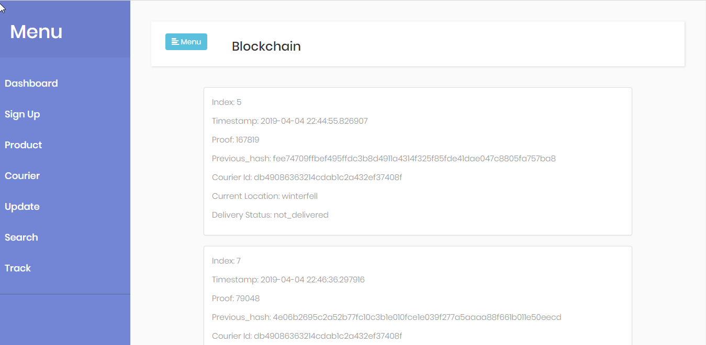
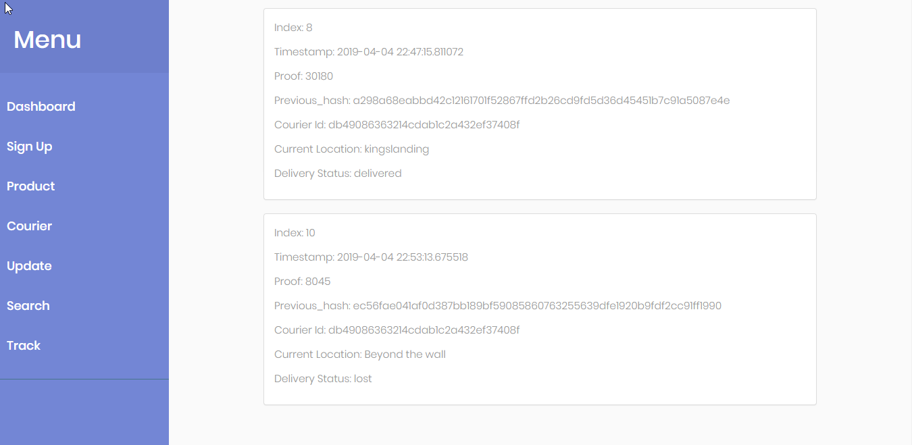
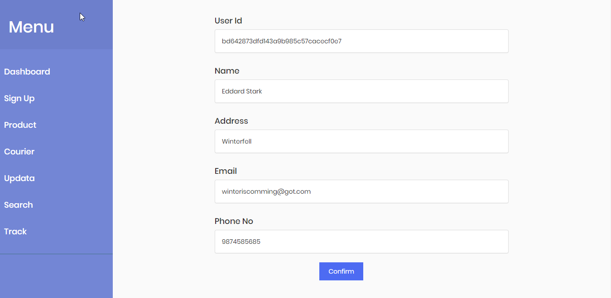
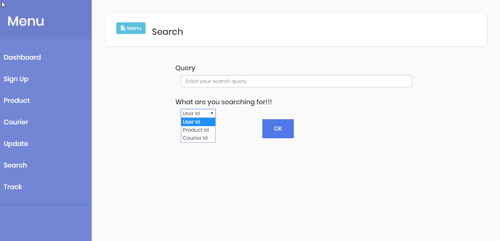
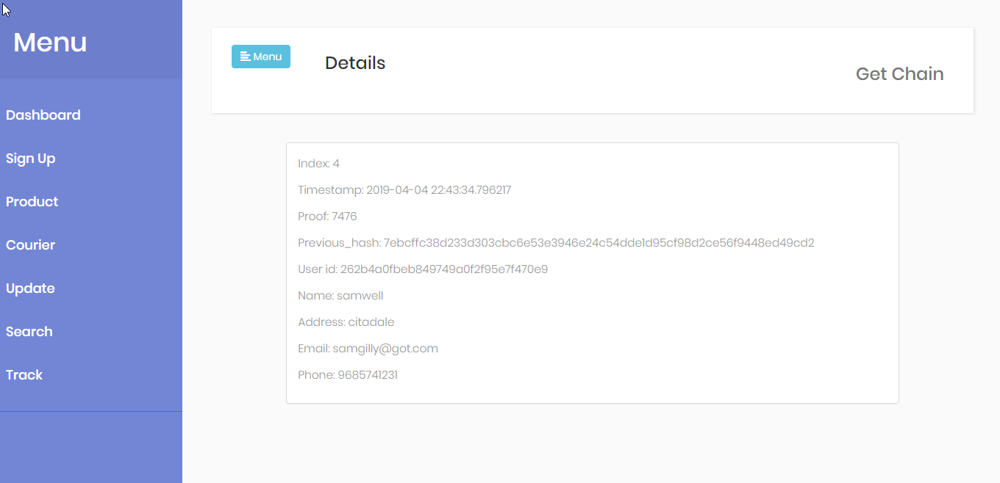
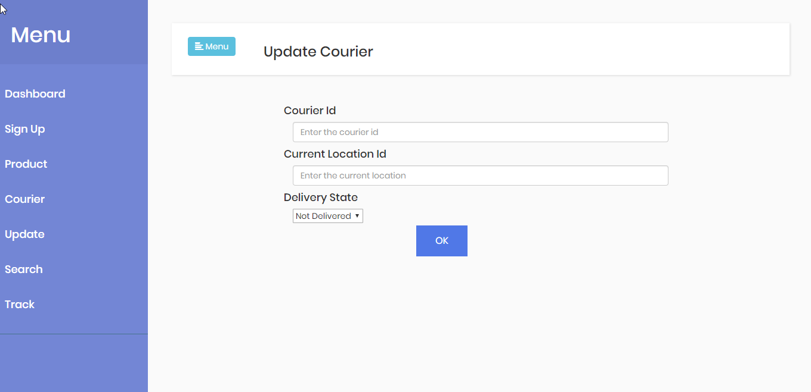
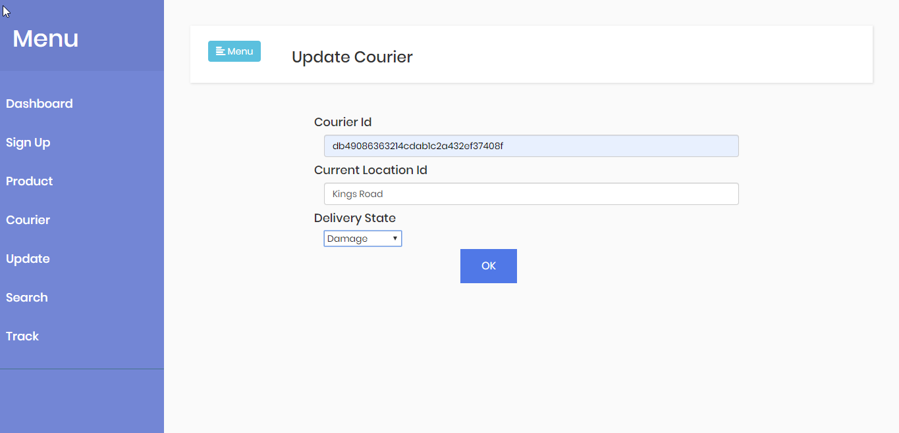
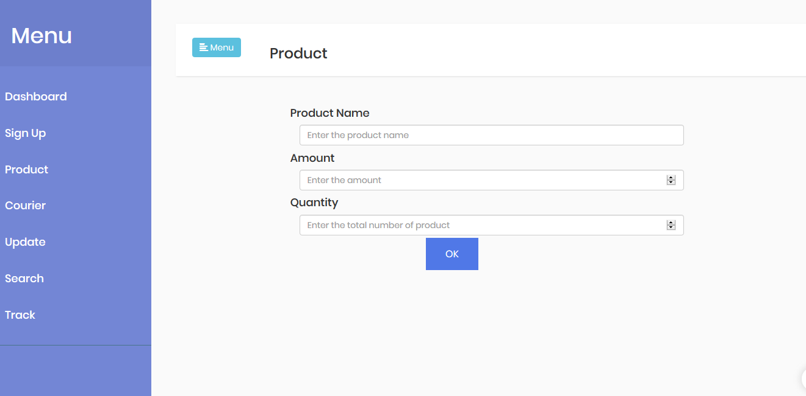
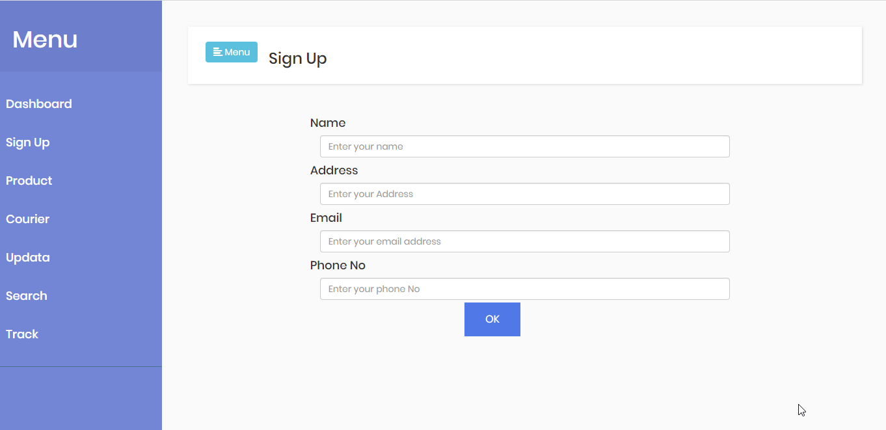
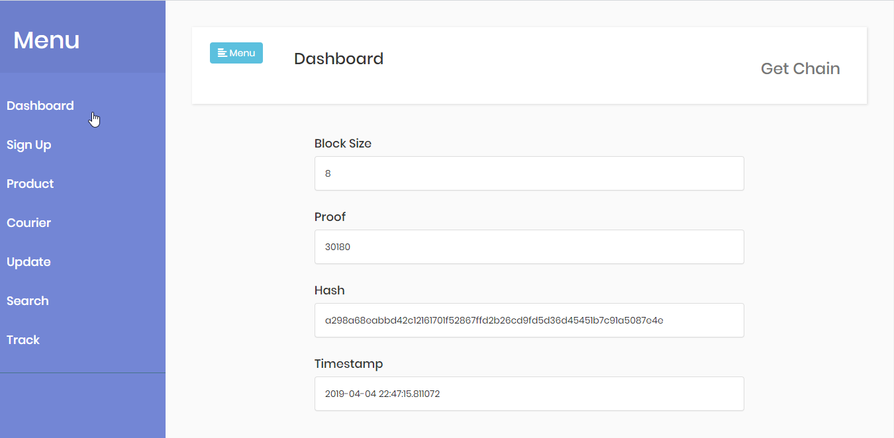

# Flask Blockchain Dashboard

This is a Flask web application that implements a blockchain-based dashboard for managing various functionalities related to signing up users, managing products, updating status, tracking, and managing couriers. All data is stored on the blockchain itself for secure and transparent data management.

## Table of Contents

- [Introduction](#introduction)
- [Features](#features)
- [Technologies Used](#technologies-used)
- [Screenshots](#screenshots)
- [Setup](#setup)
- [Usage](#usage)
- [Endpoints](#endpoints)
- [Contributing](#contributing)
- [License](#license)

## Introduction

The Flask Blockchain Dashboard is designed to provide users with a blockchain-based dashboard to manage various tasks such as signing up users, managing products, updating status, tracking shipments, and managing couriers. The application utilizes blockchain technology for data storage, ensuring security and transparency.

## Features

- User signup and login functionality
- CRUD operations for managing products and shipments
- Updating status of shipments
- Tracking shipments
- Managing couriers
- Blockchain-based dashboard for secure and transparent data management

## Technologies Used

- Flask: Web framework for Python
- HTML/CSS/JavaScript: Frontend development
- Blockchain: Implementation of blockchain for data security and transparency

## Screenshots

## Setup

1. Clone the repository:

Usage
-----

1. Navigate to the dashboard at `http://localhost:5000/dashboard`.
2. Sign up or log in to access the dashboard functionalities.
3. Perform various operations such as managing products, updating status, tracking shipments, and managing couriers.

Endpoints
---------

The Flask application provides the following endpoints:

- `/dashboard`: Dashboard for managing blockchain functionalities.
- `/get_chain`: Retrieves the blockchain data.
- `/get_block`: Retrieves data of a specific block.
- `/mine_block`: Mines a new block.
- `/is_valid`: Checks if the blockchain is valid.
- `/sign`: Renders the signup page.
- `/sign_up`: Signs up a new user.
- `/product`: Renders the product management page.
- `/product_id`: Adds a new product.
- `/status`: Renders the status update page.
- `/add_status`: Adds a status update for a shipment.
- `/track`: Renders the shipment tracking page.
- `/courier`: Renders the courier management page.
- `/courier_id`: Adds a new courier.
- `/connect`: Connects to other nodes in the blockchain network.
- `/update_chain`: Updates the blockchain data.
- `/search_data`: Renders the data search page.
- `/search_data`: Searches for data in the blockchain.

Contributing
------------

Contributions are welcome! Please follow the guidelines outlined in the [CONTRIBUTING.md](CONTRIBUTING.md) file.

License
-------

This project is licensed under the MIT License.
